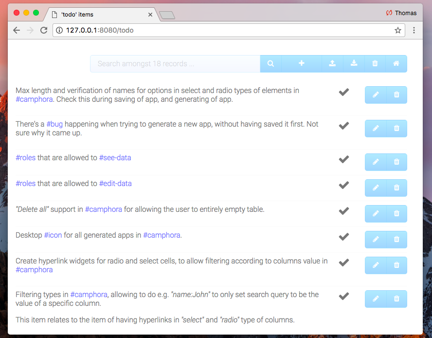
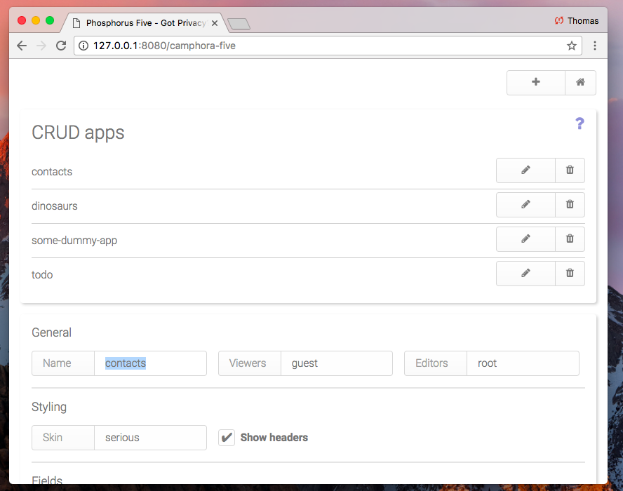
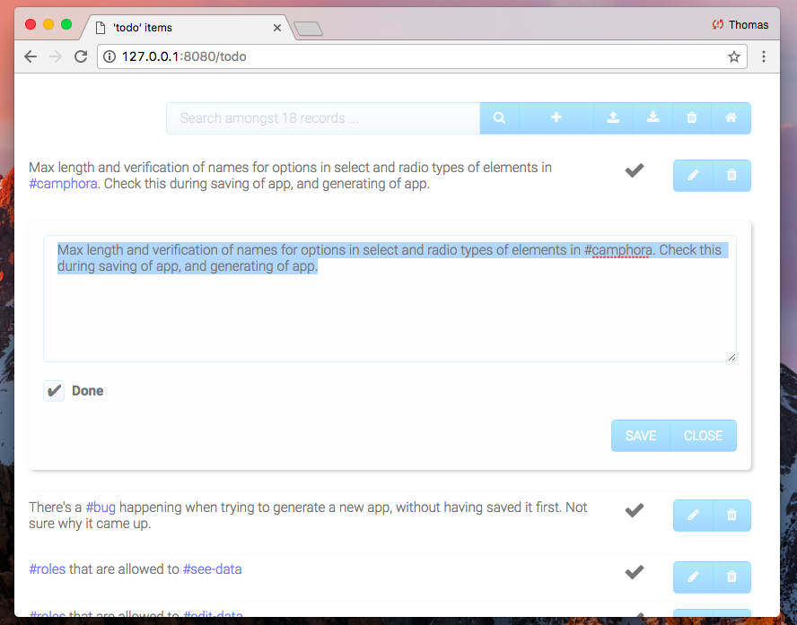

# Camphora Five - A CRUD app creator for Phosphorus Five

Camphora Five is a CRUD app generator for Phosphorus Five. It allows you to create simple CRUD apps, without
ever having done any previous coding at all. You simply declare which data columns your apps should have,
and the type of columns, for then to generate your app. The results becomes a nice CRUD app, with lots of
features, allowing you to Create, Read, Update and Delete data items from a MySQL database.

Above is an example of an app with one _"textarea"_ column type, and one _"checkbox"_ column type.

Your apps will have support for importing and exporting items in CSV file format, and there will be a real
MySQL database which your apps use to store their data. In the above screenshot, you can see how the _"textarea"_
column type, has support for both Markdown, in addition to **#hash-tags** for its items. The latter allows
you to easily categorise your items as you see fit, using hash tags.

When you create your apps, there are many different settings you can choose from, to make sure your app becomes
just as you want it to be. For instance, you can choose if you'd like to show the headers for your data grid or not,
and which skin to use. Below is a screenshot of how Camphora looks like when you're creating your apps.

Editing of items happens _"inline"_, by creating a form for your items content, which is injected into the page,
just beneath the item itself. Making the editing experience of items a very pleasent experience.

