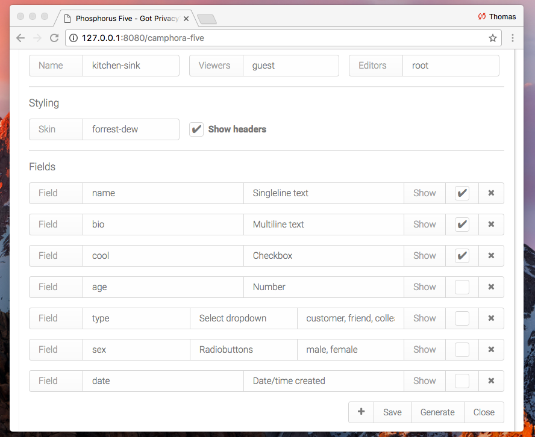
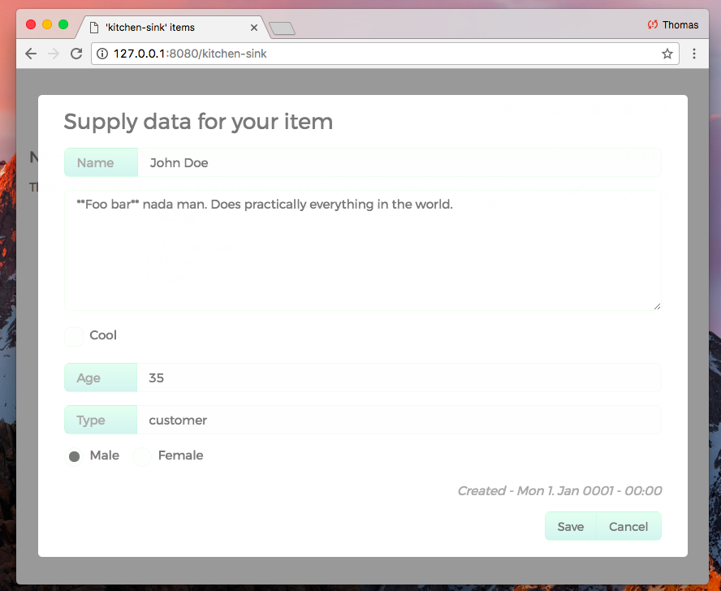
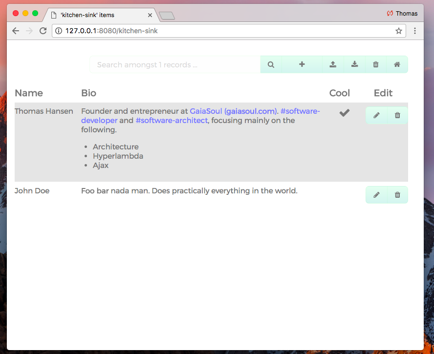

# Camphora Five - A CRUD app creator for Phosphorus Five

Camphora Five is a CRUD app generator for [Phosphorus Five](https://github.com/polterguy/phosphorusfive). It allows you to create simple CRUD apps, without
ever having done any previous coding at all. You simply declare which data columns your apps should have,
and the type of columns, for then to generate your app. The results becomes a nice CRUD app, with lots of
features, allowing you to Create, Read, Update and Delete data items from your MySQL database.X

Above is an example of an app with one _"textarea"_ column type, and one _"checkbox"_ column type.

Your apps will have support for importing and exporting items in CSV file format, and there will be a real
MySQL database which your apps use to store their data. In the above screenshot, you can see how the _"textarea"_
column type, has support for both Markdown, in addition to **#hash-tags** for its items. The latter allows
you to easily categorise your items as you see fit, using hash tags.

When you create your apps, there are many different settings you can choose from, to make sure your apps becomes
exactly as you want them to be. For instance, you can choose if you'd like to show the headers for your data grid or not,
and which skin to use. You can also create as many CRUS apps as you wish with Camphora. Below is a screenshot of how Camphora 
looks like when you're creating your apps. 

Editing of items happens _"inline"_, by creating a form for your items content, which is injected into the page,
just beneath the item itself. Making editing of items a very pleasent experience.

The apps you create using Camphora will be a _real_ Phosphorus Five application, and Camphora will create it as a separate
module, which you can distribute as you wish, using for instance [Hyperbuild](https://github.com/polterguy/hyperbuild). This allows
you to rapidly create a CRUD app, package it, and distribute it as you see fit, according to your needs. Just remember to please also
distribute the _"camphora-common"_ module if you do.

## Features of your CRUD apps

* Never ending scrolling to feed your grid with new items
* Import of CSV files at least partially matching your CRUD app's schema
* Export of your database items into CSV files, allowing you to edit and manipulate the items in e.g. Excel or Numbers
* Many different column types, including _"textarea"_, "text"_ (single line text), _"created date timestamp"_, _"number"_, etc.
* The _"textarea"_ column type support both Markdown and __#hash-tags__
* Searching to filter away items, both generically, and according to the value of some specific column
* Deleting all records at once
* Role based management of who are allowed to edit your data, and who are allowed to only see your data
* And of course, all 4 CRUD operations, such as Create items, Read items, Update items and Delete items
* Creating columns that are only visible when item is edited, and not visible in your grid

## Kitchen sink screenshot

Below you can see a CRUD app that was created with all the bells and whistles of an app turned on. First how such an app will look
like as you create it.

Then how it will look like as you create a new item. Notice, when you create an item, a modal window will appear, to allow the
user to add a new record to the database.

Then how the app will look like as you're browsing through your items.

## Modifying your app

After you have created your app, it is very easy to modify it, since it's basically just a plain normal Hyperlambda module, inside
of your _"/modules/"_ folder in Phosphorus Five. This implies that it is easily customized as you see fit, and you can edit the
app, using your favourite text editor, and/or Visual Studio, to add custom features. This allows you to use your generated app
as a _"template"_ for creating your own apps, and apply your own customization afterwards, such as your design, additional features,
etc, etc, etc.

## Installation

The easiest way to install it, is to [install phosphorus five](https://github.com/polterguy/phosphorusfive),
for then to visit _"The Bazar"_, and simply install it through the Bazar on your local machine/server.
However, if you want a more manual installation path, you can download the latest release,
unzip it, and move the unzipped root folder into your _"core/p5.webapp/modules"_ folder. If you
choose this path, you should rename the folder, removing any version information, making sure
your module folder is called exactly _"camphora-five"_. Installation through the Bazar
also requires you having some sort of GnuPG client on your machine/server. If you don't want
to fiddle with installing GnuPG, you can resort to download the latest zip file release directly.

## Scalability

Since the underlaying database for your apps is a real database - MySQL that is - It is possible to create CRUD apps with 
hundreds of thousands of records, while still having your app perform reasonably well during usage. This makes Camphora Five
highly usable for everything from your private TODO records and CD collection, to public libraries needing to index possibly 
millions of records.

## License

Camphora Five is licensed as GPL version 3, but proprietary licenses exists, that allows you to create proprietary apps.
Read the [lisence terms here](https://gaiasoul.com/license).
